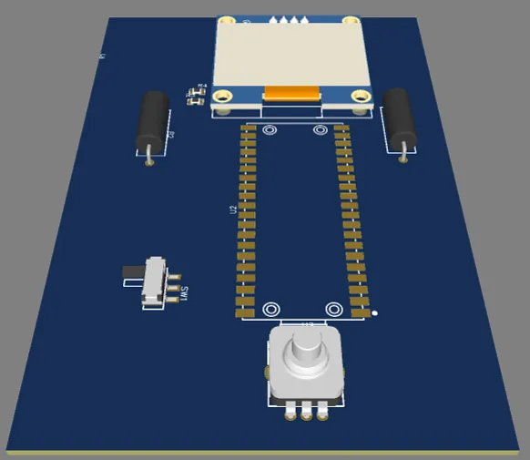
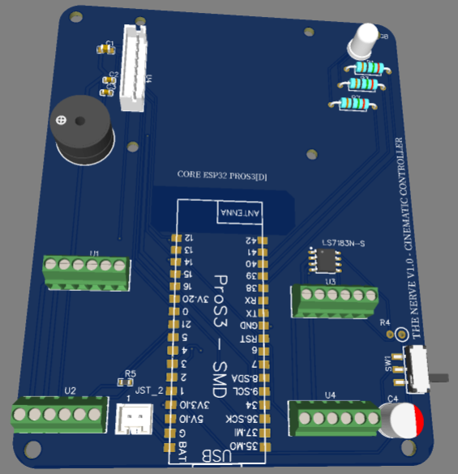
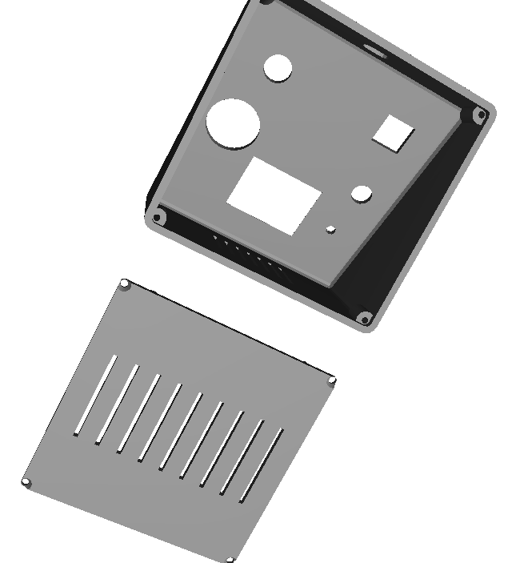
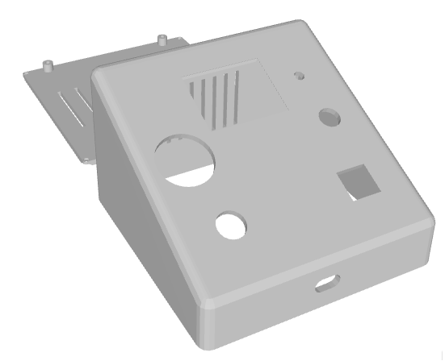
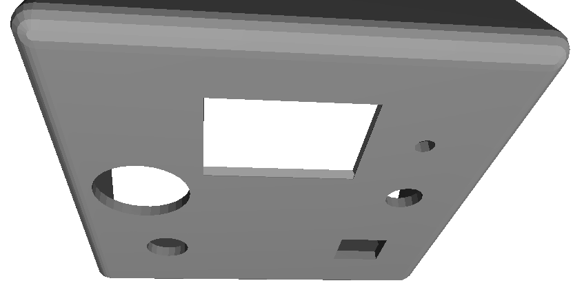

# The Nerve – Build Log

---

**Feb 1** — *~2h*
**Step 1: Concept & Prototyping**
I've been wanting to build some kind of physical control panel. Not a keyboard macro thing, something more serious. Started by testing a Hall Effect joystick I had sitting around. Wired it to a breadboard to see if the analog values were stable.

---

**Feb 1** — *~2h*
**Step 2: Serial Reading & Filtering**
Read the analog values over serial using an RP2040. It works, but the output is noisy as hell without proper filtering. I spent some time writing a basic moving average filter in software to smooth out the jitter. Already thinking about how to handle that on the PCB with decoupling capacitors.

---

**Feb 5** — *~2h*
**Step 1: EasyEDA Setup & Symbols**
Opened EasyEDA and started the schematic from scratch. The standard terminal block footprints didn't match the KF128 connectors I plan to use, so I spent time drawing a custom footprint with a 2.54mm pitch.

---

**Feb 5** — *~2h*
**Step 2: Power Rail Design**
The power rail took way longer than expected. I kept going back and forth between using an LDO regulator vs. just pulling 3.3V directly from the ESP32 pin. Went with the LDO in the end — putting the OLED and the analog joystick on the same rail without proper regulation is asking for noise problems.

---

**Feb 10** — *~1h*
**Step 1: The Crash**
Browser crashed mid-session and I lost about an hour of routing work because there was no autosave. That was incredibly frustrating, but it gave me an idea.

---

**Feb 10** — *~2h*
**Step 2: The "Panic Button" Concept**
If the whole point of this device is to help me work faster and not lose stuff, it should have a physical save button. I wired up a Cherry MX switch on the breadboard to send a USB HID command that forces a `git push`. 

---

**Feb 10** — *~2h*
**Step 3: Battery Monitoring Circuit**
Added a voltage divider circuit to the schematic so the ESP32 can monitor the LiPo battery level. Used high-value resistors to minimize current leakage.

---

**Feb 11** — *~1.5h*
**Step 1: Display Interface Switch**
Switched the display from I2C to SPI in the schematic. I was originally using I2C because it requires fewer wires, but the refresh rate was too slow for what I want to show on screen. 

---

**Feb 11** — *~1.5h*
**Step 2: SPI Testing**
Wired up the Waveshare 1.5" OLED via SPI to test the new interface. It handles the faster refresh rate perfectly. Had to redo some of the schematic traces for the extra SPI pins (MOSI, CLK, CS, DC, RST) but it wasn't a big deal.

---

**Feb 12** — *~1.5h*
**Step 1: MCU Evaluation**
Locked in the ESP32-S3 ProS3 as the main MCU. The regular ESP32 doesn't have native USB HID, which I need for the Panic Button to actually work as a keyboard. 

---

**Feb 12** — *~1.5h*
**Step 2: MCU Integration**
Updated the schematic with the ESP32-S3 ProS3. It has a built-in LiPo charger, which saves me from adding a TP4056 IC to the board. It also has plenty of flash memory for future UI assets.

---

**Feb 13** — *~2h*
**Step 1: Modular Input Strategy**
Decided not to solder the inputs directly to the PCB. The joystick, encoder, and switches are all going through screw terminals or JST connectors instead. I kept imagining having to desolder a Cherry MX switch because of a bad trace, and that was enough to convince me. The PCB is the brain; the inputs are modular.

---

**Feb 14** — *~2h*
**Step 1: Component Placement**
Spent the morning organizing component placement on the board. Trying to keep the high-frequency SPI lines away from the sensitive analog joystick traces.

---

**Feb 14** — *~2h*
**Step 2: Routing High-Speed Lines**
Routed the SPI bus to the OLED connector. I made sure to keep the traces as short and direct as possible to prevent signal degradation.

---

**Feb 14** — *~2h*
**Step 3: Noise Mitigation**
Because the SPI lines and analog traces run somewhat parallel, I added ground traces between them (guard traces) and moved the passive buzzer components further away to prevent noise coupling into the ADC.

---

**Feb 15** — *~2h*
**Step 1: Finalizing 2-Layer Routing**
Finished the general 2-layer routing. Connected all the pull-up resistors and decoupling capacitors to their respective ICs.

---

**Feb 15** — *~2h*
**Step 2: Ground Pours**
Added a full ground pour (copper fill) on the bottom layer, and stitched it to the top layer ground pour with vias. This should provide a solid reference plane and reduce EMI.

---

**Feb 15** — *~2h*
**Step 3: DRC and Pad Verification**
Ran the Design Rule Check (DRC). Went back and checked every SMT pad size against the JLCPCB manufacturing rules. Last time I ordered a board I had an annular ring violation. Fixed a few minor clearance issues. The board is ready for manufacturing.

---

**Feb 18** — *~2h*
**Step 1: Exporting 3D Models**
Started the enclosure in OnShape. Exported the finished PCB as a STEP file from EasyEDA. 

---

**Feb 18** — *~2h*
**Step 2: Mechanical Fit Check**
Imported the PCB STEP file into OnShape to check if the connector positions actually line up with the enclosure walls. They didn't — the USB-C port was about 1.5mm off from the cutout I had drawn. Fixed the wall opening to match the board.

---

**Feb 22** — *~2h*
**Step 1: Enclosure Ergonomics**
Finalized the main case body. Went with a 15-degree wedge angle so the panel faces slightly upward when sitting on a desk, making the screen easier to read and the buttons more ergonomic to press.

---

**Feb 22** — *~3h*
**Step 2: Thermal Management & BOM**
Added vertical slots on the back wall for airflow — the ESP32-S3 gets warm under load (especially with Wi-Fi active) and I don't want it cooking inside a sealed plastic box. Updated the BOM spreadsheet with some mechanical components I had been putting off.

---

**Feb 23** — *~2.5h*
**Step 1: Manufacturing Files**
Updated all the PCB hardware files to the latest revision. Generated the new Gerber files (ZIP) required by JLCPCB for fabrication.

---

**Feb 23** — *~2.5h*
**Step 2: PCBA Sourcing**
Fixed the PCBA (assembly) BOM for JLCPCB. Corrected a few part URLs that were pointing to the wrong items. The 10uF capacitor was mapped to a part that's out of stock — swapped it to C1713 which is always available at LCSC.

---

**Feb 24** — *~2h*
**Step 1: Translation & Upload**
Translated my personal notes into English for the public journal. Uploaded all the in-progress photos from my phone to the repo's `assets/` folder to document the build process visually.

---

**Feb 25** — *~1h*
**Step 1: Repo Aesthetics**
Added a banner and hero image to the README. Small stuff, but it makes the project page look much more professional when a reviewer opens it.

---

**Mar 5** — *~1.5h*
**Step 1: Switch Tolerances**
Prep work for 3D printing. The Cherry MX cutout needed to be exactly 14.05mm for a snap-fit without glue. Anything looser and the switch wobbles when pressed. Went back into OnShape and refined the tolerance. 

---

**Mar 5** — *~1.5h*
**Step 2: Screen Visibility**
Added an inner 45-degree chamfer to the OLED window in the CAD model so the screen doesn't look deeply recessed from the front panel. It improves the viewing angle significantly.

---

**Mar 10** — *~2h*
**Step 1: Firmware Commit**
Big cleanup day. Committed the actual MicroPython firmware file (`firmware/main.py`) to the repository. 

---

**Mar 10** — *~2h*
**Step 2: Wiring Documentation**
Created a detailed wiring diagram (`WIRING_DIAGRAM.md`) for anyone who wants to replicate the project and needs to hand-wire the panel inputs to the PCB screw terminals. 

---

**Mar 11** — *~2h*
**Step 1: File Sync**
Replaced all the old PCB files with the final EasyEDA version. The initial files I had were from an earlier iteration. Uploaded the correct Gerbers, BOM, and Pick & Place files to the `hardware/fabrication/` folder. 

---

**Mar 11** — *~2h*
**Step 2: Cost Tracking**
Updated the cost table in the budget doc with real checkout prices per vendor, including shipping and MOQ requirements. 

---

**Mar 12** — *~3h*
**Step 1: BOM Audit**
Spent the morning auditing the budget. Went through every single item and pulled real checkout screenshots. The passive components come in packs of 20 or 50, so the real cost to build is higher than just adding unit prices. 

---

**Mar 12** — *~3h*
**Step 2: Budget Finalization**
Updated the official BOM CSV and the budget Markdown doc to reflect the real-world checkout totals. Cleaned up the whole repo structure to make the files easier to find.

---

**Mar 13** — *~1h*
**Step 1: Instructions**
Finished writing the README. Added explicit firmware setup instructions and clarified where to find the 3D source files (STEP and OnShape link).

---

**Mar 15** — *~1h*
**Step 1: Navigation**
Added a reviewer's note at the top of the README to help them navigate the project quickly. The repo is getting dense, so clear signposting is necessary.

---

**Mar 17** — *~1h*
**Step 1: Visuals**
Organized the image folders and embedded the final case render photos directly into the README so reviewers can see the finished enclosure without digging.

---

**Mar 19** — *~2h*
**Step 1: Sourcing Cheaper Parts**
Found that many of the external components (joystick, encoder) were way cheaper on AliExpress than on Mouser or Adafruit. Sourced a K-Silver Hall joystick and an industrial encoder.

---

**Mar 19** — *~2h*
**Step 2: Budget Overhaul**
Updated the BOM with the new AliExpress sources and added a cart screenshot as proof of the lower prices. This significantly drops the total cost.

---

**Mar 21** — *~2h*
**Step 1: Prep for Resubmission**
Full project overhaul for resubmission. Rewrote parts of the README to be more direct, tightened up the budget document, and ensured the journal format is clean.

---

**Mar 22** — *~2h*
**Step 1: Reviewer Feedback Analysis**
Received reviewer feedback. The main questions were about the necessity of the battery and why I specifically chose the ESP32-S3 over a cheaper microcontroller. 

---

**Mar 22** — *~4h*
**Step 2: Addressing Concerns**
Wrote detailed justifications in the README explaining that the battery is required for the device to operate as a standalone Wi-Fi automation trigger (sending webhooks without a PC). Added the public OnShape link so reviewers can inspect the CAD model natively.

---

**Mar 24** — *~1h*
**Step 1: Tier 3 Optimization**
Finalized Tier 3 cost optimization by replacing the expensive optical encoder with a $1.23 standard EC11 Quadrature Encoder. Rewrote the journal entries to act as raw engineering logs.

---

**Mar 25** — *~1h*
**Step 1: Final Verification**
Went through everything one last time. Verified that the cart screenshots match the BOM quantities exactly, double-checked the shipping method on the JLCPCB order, and made sure all the files in the repo are the latest versions.

---

**Mar 26** — *~1h*
**Step 1: Log Formatting**
Final pass on the engineering logs. Added image references throughout, standardized the Step-by-Step format, and ensured every entry has enough technical context.
