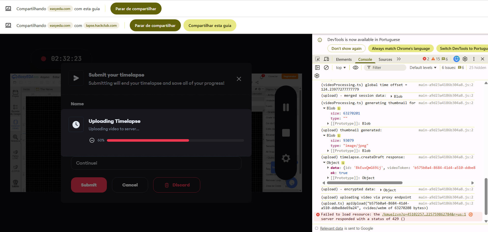
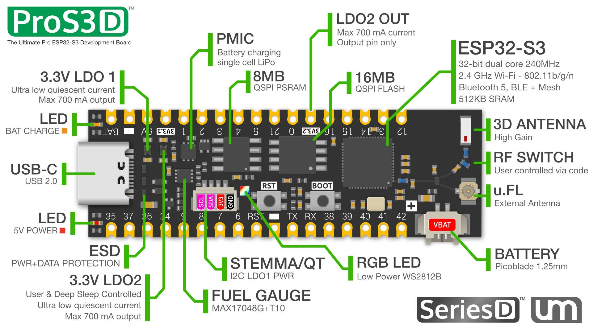
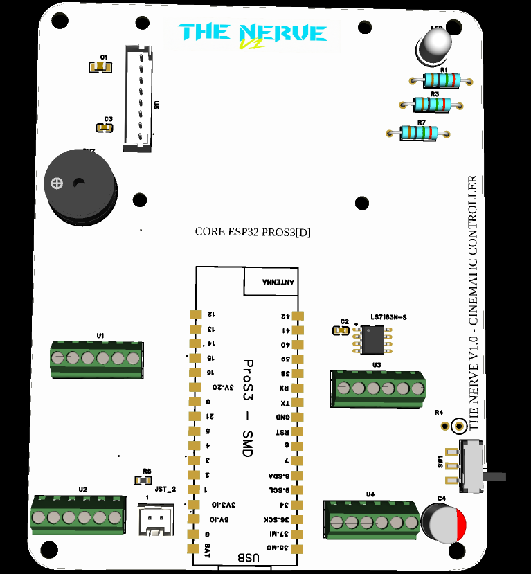
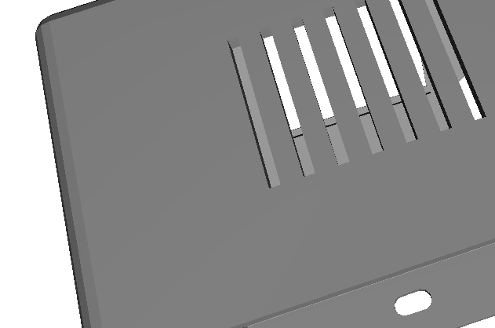
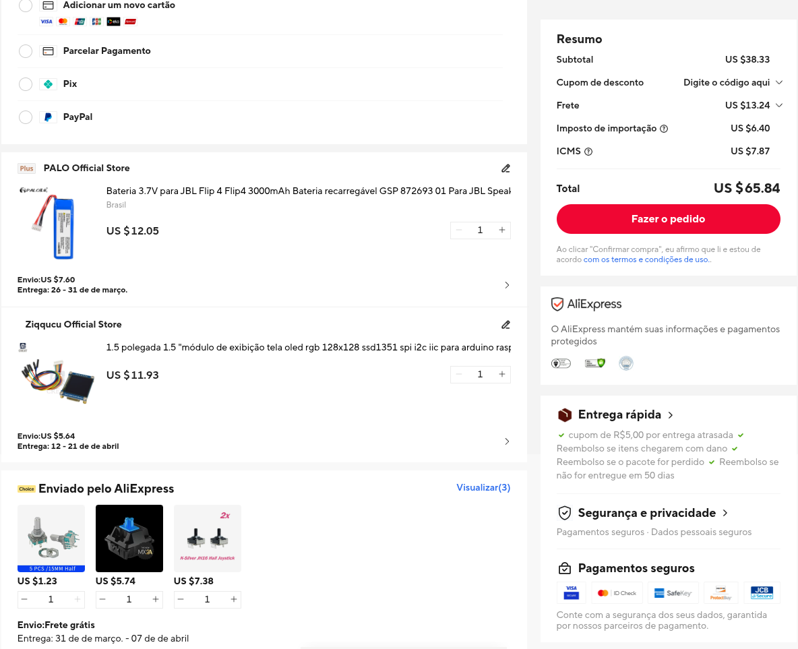
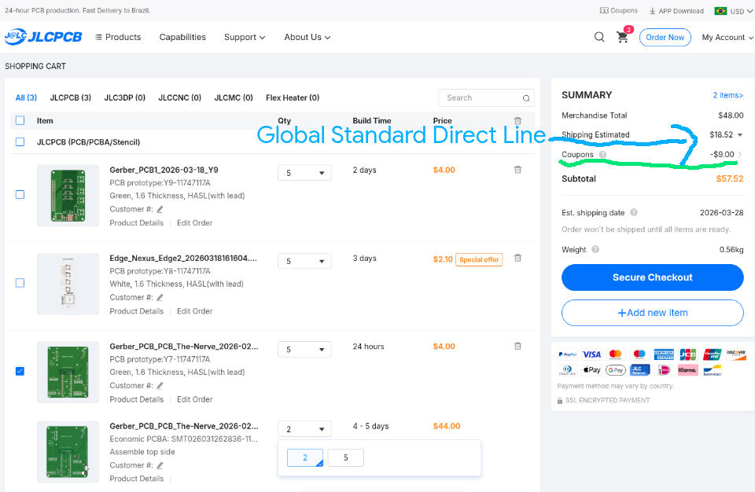

# The Nerve Build Logs

***

- A little before this: I had discovered Blueprint because I was already participating in Flavortown, but it said it would end on January 24th, as far as I remember, so I didn't start any projects for fear of not having enough time and also because I was traveling. But I already had an idea of ​​what I wanted to do and it suited me...

### Feb 1 — Initial Concept

I wanted to build something that wasn't just a different kind of "macropad" from the tutorials on the website. So one of the first things I thought of was the joystick; a Hall Effect would allow me to have my pipelines and receive feedback without extreme noise and still be precise. So I started studying them and seeing how to implement a code snippet for it, even without having a completely finished PCB design.

---

### Feb 1 - 5 — Power & Footprints

I started the schematic and organizing the components I was going to use. The footprint of a `KF128` terminal that I was going to use wasn't available, so I started designing one myself. I was studying how to make **PCBs** and **best practices**, so I already thought about an LDO regulator and connections for the OLED in order to keep everything on the same power supply path. And also how to mitigate noise and interference.

---

### The panic button and OLED

My sister's browser, which was an ARM64 notebook, was bugging/losing my Lapse recordings, both routing and some other things I developed for my projects in Flavortown. So I decided that having a physical "Save/Push" button. 

I wired the button and thought about how to force saving at that point like a `git commit`. I also added a voltage divider with high-value resistors to the schematic so the ESP32 can monitor the LiPo level without draining it.

---

### Feb 11 — SPI Over I2C

I changed the display from I2C to SPI because the SPI protocol is faster, more stable (if I'm not mistaken), and provides more organized data; the information is more accurate. I was already thinking about how to connect the data pins and other items to it.

---

### Feb 12 — MCU Choice

Locked in the ESP32-S3 ProS3. The standard ESP32 doesn't have native USB HID support, which I need for the hardware macros to work properly as a keyboard. Plus, the ProS3 has a built-in LiPo charger, so I don't need an extra TP4056 chip on the board. Besides the better processing it offers.

---

### Feb 13 — Modularity

I decided not to solder on the board anymore because if I wanted or needed to change any component, I wouldn't be able to easily. There was also the risk of damaging some part of the PCB. So I used JST terminals for the external components of the board (encoder, switches, OLED, etc.), making it modular as I like it.

---

### Feb 14 — Routing & Noise

Spent the day routing the SPI lines. Keep them as short as possible and far away from the analog joystick traces. I also added ground guard traces between them to prevent the high-speed data lines from leaking noise into the analog signals. 

---

### Feb 15 — Ground Planes & DRC

Here I was starting to focus more on routing the vias of the second layer of the PCB.

---

### Feb 18 — CAD and Enclosure Mechanics

I exported the EasyEDA STEP to `OnShape` and started developing the board shape based on it. I had already worked with it last year in my Industrial Automation technical course, but I didn't know much about it. I left the hole for the ESP's USB-C and made sure everything was going well.

---

### Feb 19 - 22 — Ergonomics & Heat

Finalized the case with a 15-degree angle. It's much easier to read the screen on a desk this way. Added ventilation slots on the back because the ESP32-S3 can get warm when processing many things or in a more intense pipeline. It's also good for a longer lifespan of the components as a whole.

---

### Feb 27 — Firmware

I was finishing and testing only the logic (since I didn't have physical items) of the code I was going to use in it. Here I changed the name of the file from `firmware.py` to `main.py`, improved it, and thought about how I was going to handle the integrations and some simple things with n8n. I had simple workflows and items of that type in the snippets I researched/developed.

- In the meantime, I only tweaked the project a little. I missed some lapses and was working on other things. But I continued aligning some routing paths and making some final touches in both EasyEDA and OnShape. I also received a message from the reviewer saying that I hadn't added items to the cart that weren't in the design, so I started showing how the other items fit into the PCB/worked as a whole.

### Mar 12 — BOM ​​Audit & Cost

Audited the budget. The prices for parts like the joystick and encoder are much better on AliExpress than on Mouser. Swapped the sources in the BOM and updated the total cost.

---

### Mar 22 — Reviewer Feedback

Got feedback asking why the battery is necessary and why the ESP32-S3 instead of something cheaper. The battery question is fair — the whole point of standalone mode is that it sends webhooks and triggers automations without needing a PC open. If it had to be tethered to USB for power, half the use case disappears. Wrote detailed justifications in the README and added the public OnShape link so the reviewer can inspect the CAD natively.

---

### Mar 24 — Refinements

I simplified the encoder setup, swapped some BOM components for cheaper versions. I tidied up the README and other parts of the repo and added the rate/shipping verification that a reviewer had requested.

---

### Mar 25 — Final Verification didn't work :(

Went through everything one last time. I checked and took screenshots for the submission form, saw if all the files and items were in their proper places, and did a little organizing of the docs.

---

### April 15 — Reorganizing the repo

I rewrote the project docs and still need to find a new battery for it, because I think it's no longer available and I haven't checked if it will fit completely in the enclosure. Finding one that already has the `JST pins with a 2mm pitch`, as far as I remember, isn't easy.

> I also need to remove the screenshots from the carts because I removed the PCBA service from JLCPCB (it was over $40!) to stay within tier 3. I think that's it. Prepare the screenshots, check the prices and if anything has changed in the services/marketplaces where I chose the products, and finally make sure everything is correct in the repo and in the Blueprint submission form.