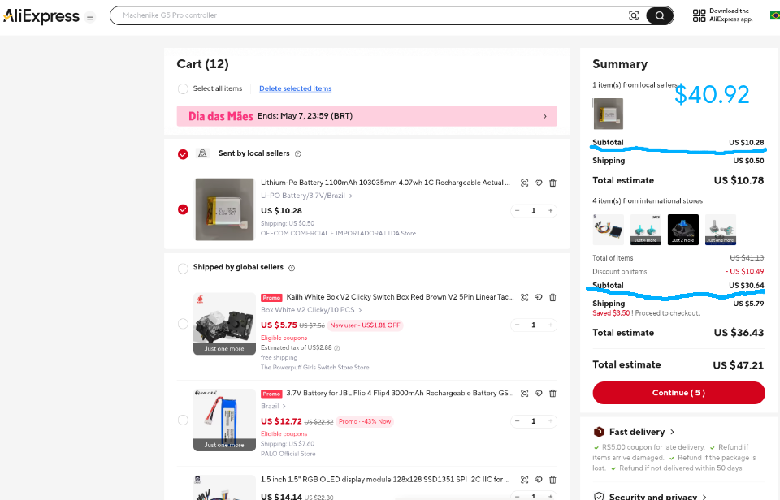

# The Nerve Build Logs

_My first hardware project ever._

Approximate time: **~82h**

I found Blueprint while I was already around Flavortown. I almost didn't start anything because I thought the deadline was too close, and I was also traveling, but this idea kept coming back. I didn't want to make only another macropad. I wanted something physical for the stuff I keep doing in browser tabs: `n8n`, webhooks, video things, little automations, maybe a homelab later. _Keeping all of that only on the web is kind of boring_ :/

So The Nerve started as this idea of a **small control board** with real controls outside and an `ESP32` inside. At the start I did not know if it would work. I just knew I wanted to try.

---

### Feb 1

_Time spent: ~4h_

The first thing I thought about was the joystick. I liked the idea of using a `Hall Effect` one because I wanted smooth control and less noise/drift than a normal cheap joystick.

I was still not drawing the final PCB here. It was more like opening tabs, reading, looking at examples, thinking how this could connect with macros and webhooks. I kept thinking "ok but what would I actually use this for after building it?" because I didn't want it to be just a box with buttons.

The rough idea became: **joystick** for fine control, `OLED` for quick status, encoder for changing values, and a switch/button for actions that should feel physical.

---

### Feb 3

_Time spent: ~5h_

Started the schematic in `EasyEDA`. The first annoying thing was the `KF128` terminal. I couldn't find the exact footprint I needed, and using a random one felt like asking for problems later, so I made the footprint myself.

It sounds small, but this took more patience than I expected. Pitch, drill holes, spacing, checking if it made sense... _that kind of boring work that is only boring until it ruins the board_.

I also started organizing the power side. I added the `LDO` and tried to keep the `OLED`/main logic on a stable path. I was already worried that display/power noise could make the joystick readings worse.

---

### Feb 7

_Time spent: ~3h_

This was where the **panic button** idea came from. I was using my sister's `ARM64` notebook, which is basic and doesn't have much memory. `Lapse` was also changing a lot because it is a Hack Club app and they are always improving stuff, so maybe some build/update broke a small part of the upload flow for me.

One upload got stuck around the middle and I lost hours of recording/proof. I was at home. It was not even a cool dramatic moment, it was just _sitting there angry because hours of work disappeared for something stupid_.

I remember thinking something like: "_man, I need an emergency save thing. I can't lose renders, automation data, proof, whatever, just because the browser decided to die._"

That's how the physical save/panic switch got into the design. Not exactly only `git commit`, because `git`/GitHub already save code well, but the idea of forcing a **snapshot/state save** for important project stuff. A real button for "please save this now before something breaks again" :)

---

### Feb 11

_Time spent: ~2.5h_

I changed the `OLED` from `I2C` to `SPI`.

At first `I2C` looked simpler, but the display is supposed to show useful status while the device is being used, not just sit there. `SPI` seemed better for that because it is faster and more comfortable for screen updates.

The downside is that now I had faster digital lines on a board that also has analog joystick signals. So the display choice made the routing more annoying later. _That is the kind of thing I only started to understand while doing it._

---

### Feb 12

_Time spent: ~2h_

I decided to use the `ESP32-S3 ProS3`. A normal `ESP32` would be cheaper, but it doesn't have native `USB HID` in the way I needed. I wanted The Nerve to be able to act like a keyboard/controller for macros and debugging, and also use Wi-Fi/Bluetooth for webhooks/`n8n` stuff.

The `ProS3` having `LiPo` charging helped a lot too. I really did not want to add a separate charging circuit like a `TP4056` on my first board if I could avoid it. _There was already enough to mess up._

---

### Feb 13

_Time spent: ~4h_

I started changing the board so the **external parts were not soldered straight into it**.

This came from how I like to build things. I like testing, touching, swapping parts, changing my mind. If the joystick starts drifting later, or if I want another encoder, or if a switch breaks, desoldering it from the PCB sounds like pain. And if I damage the board while doing that, then the whole project suffers.

So I moved more things to `JST` connectors and `KF128` terminals. It made the board feel less like one fixed object and more like a base where the parts plug in.

Later, when I removed `PCBA` to save money, this decision made even more sense. If I am already soldering the `PCB` by hand, I don't want every external part to also be a permanent problem.

---

### Feb 14

_Time spent: ~7h_

**Routing day.** A lot of routing and complaining :/

The `SPI` lines had to stay away from the analog joystick traces as much as possible. I was trying to keep them short, route them cleanly, and add **ground guard traces** between sensitive parts. I don't know if every small choice here is perfect, but I was at least trying to not make a noisy mess.

This was also when I started seeing why `PCB` work takes time. _You move one trace and suddenly three other things are worse._ Then you fix those and the board looks ugly. Then you change it again.

---

### Feb 15

_Time spent: ~5h_

Worked more on the second layer, vias, ground pours, and `DRC`.

Some warnings made sense quickly, some didn't. I kept looking at the board visually too because passing a check in the editor doesn't mean I will understand the board later. _I wanted future me to open the file and not hate past me too much._

---

### Feb 18 - 19

_Time spent: ~9h_

`OnShape` on Android was bad for this. I didn't remember the tool that well, and on the app the buttons/menus are different enough that I had to keep searching for basic stuff. Uploading footprints and 3D files, like the `ESP32-S3` model from Unexpected Maker, was also painful. Internet would get bad, upload would fail, and after some time I just gave up on the app because _I was more likely to break the design than improve it_.

Around Feb 10, I think, my own **Positivo notebook** arrived. That helped a lot. It is not a gaming PC, but I am not playing much now anyway, and for `EasyEDA`/docs/tabs it was enough. A 15.6" screen after trying to do things in worse setups felt very good :D

The weird network thing happened on my notebook, not my sister's. `OnShape`'s `/en` URL didn't load right. I had seen something kind of similar with GitHub Codespaces before, where I thought maybe I was blocked because of compute hours, but I looked at the usage page and it wasn't that. I opened `F12`, looked at the network stuff, and thought: "_what if I route this like it is coming from the US?_" Tried a VPN and it loaded.

It didn't take forever to solve, but _these small blocks eat patience_.

---

### Feb 20

_Time spent: ~5h_

I worked more on the enclosure using the `EasyEDA` `STEP` in `OnShape`. I wanted the case tilted because a flat box on the desk would be worse to look at and use, so I made it around **15 degrees**.

I also added back ventilation. The `ESP32-S3` can get warm if it is doing more things, and closing everything inside a printed case with no airflow felt wrong. Maybe the vents are not magic, but at least _I am not pretending heat doesn't exist_.

---

### Feb 27

_Time spent: ~8h_

I worked on the firmware logic without having the physical parts. _This is weird because you are kind of writing for hardware that exists only in your head and files._

I renamed the firmware to `main.py`, cleaned some ideas, and thought about how the joystick/encoder/`OLED`/panic button would map to real actions. `n8n` webhooks, `HID` macros, status on screen, things like that.

Some of it was not final code, more like testing the logic and seeing if the hardware choices still made sense. **I wanted each part to have a reason to exist.**

---

### Feb 28 - Mar 10

_Time spent: ~7.5h_

_This part is hard to write as one clean story because it was not clean._ It was small work spread across days.

I adjusted routes, fixed little `CAD` things, organized files, lost/missed some `Lapse` recordings, and kept checking if the external parts made sense with the `PCB`. A reviewer had mentioned that I had cart items that were not clearly shown in the design, so I tried to make that connection more obvious.

_This is the kind of project work that doesn't look impressive in one screenshot but still takes hours._

---

### Mar 12

_Time spent: ~4h_

**Budget time.** Not fun, but necessary.

I saw that some parts were much cheaper on AliExpress than on Mouser, especially things like the joystick and encoder. So I changed sources in the `BOM` and recalculated.

This was when the project started turning into "_can I actually fit this under the grant limit?_" instead of only "_can I design this?_"

---

### Mar 22

_Time spent: ~3h_

Reviewer feedback asked why the battery was needed and why `ESP32-S3` instead of something cheaper.

Fair questions. The battery is there because standalone mode is part of the point. If The Nerve always needs a PC/USB cable for power, then it loses a lot of the webhook/automation idea. And the `ESP32-S3` is because of native `USB HID` plus Wi-Fi/Bluetooth, and the `ProS3` also saves me from adding a separate charger circuit.

I rewrote those explanations so the reviewer would not have to guess.

---

### Mar 24

_Time spent: ~3h_

I simplified some things, changed cheaper `BOM` parts, and added the `JLCPCB` shipping verification that had been requested.

Here I started learning that **hardware documentation is almost another project**. It is not enough to have files. The reviewer needs to see prices, carts, why the parts exist, and how everything connects.

---

### Mar 25

_Time spent: ~2h_

I tried to do a final verification. _It didn't really feel final_ :(

I looked at the submission form, files, screenshots, and repo organization. Some things were okay, some things still felt like they might need another pass. This happened a lot with this project. I would think "ok now it is done" and then one more image/price/explanation would be wrong or missing.

---

### April 15

_Time spent: ~4h_

I reorganized docs and kept looking for a battery. I needed one that would fit the enclosure and ideally already have `JST` with `2mm pitch`. That sounds simple until you actually start checking sizes, connectors, and availability.

I also removed `PCBA` from `JLCPCB` because it was over $40 and pushed the project too close/outside the Tier 3 budget. That means hand soldering, including small `0603` parts. _Not exactly relaxing._

But it also made the connector/modularity choice feel right. If something goes wrong with an external part, I don't want to desolder half the project.

---

### April 28

_Time spent: ~0h project work_

Not much progress. _Real life got in the way._

The dollar was around the normal painful value here, close to `R$5` for `$1`, and I saw people talking about Hack Club maybe not covering shipping/taxes. That made me worry a lot because hardware in Brazil gets expensive fast. I even wondered if there was some kind of document that could help show it is a STEM/student donation thing, but I don't know.

Also college started taking space in my brain: Calculus, Analytical Geometry, programming things, house stuff. For a while I thought the review window had already passed, so I kind of left the project aside.

_Not a productive log, but it is true_ :/

---

### May 5

_Time spent: ~4h_

I saw that re-review still seemed open, so I did another final pass. Again "_final_" lol.

I took/added new cart screenshots, looked at the prices again, fixed the `BOM`/budget numbers, and made sure the `BOM` was using only merchandise/component prices, not shipping and taxes.

- Adafruit: $30.45
- JLCPCB: $4.00
- AliExpress: $40.92
- LCSC: $14.18
- **Final hardware cost:** $89.79

I also fixed the `PCB` image label because the blue layer was **bottom**, not top. That one was important because calling a PCB layer wrong looks bad. Then I restored the colorful `Tinkercad` render because the grey render was too lifeless and didn't show the project well. The colorful one shows the joystick, `OLED`, encoder, and switch sitting on the enclosure, which is much clearer.

Now I think it is ready for re-review. I hope :D
