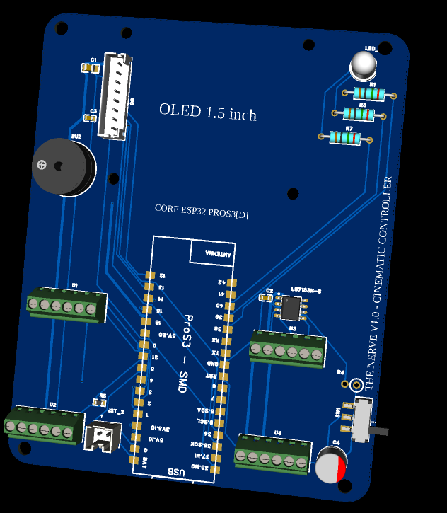
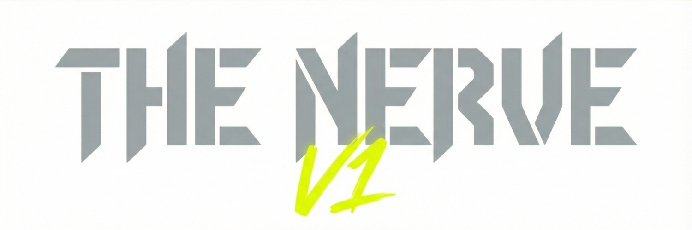
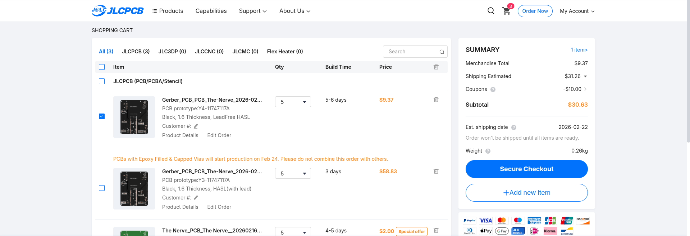

# The Nerve – Modular Automation Cyberdeck


> **Project Status:** Hardware Frozen • Firmware in Development (ESP32-S3 + USB HID)

The Nerve is a tactile command center built to bring physical control back to digital workflows. Initially designed to automate video production pipelines (n8n + FFmpeg), its open hardware architecture makes it a powerful universal controller for developers, editors, and creators.

Out of the box, it bridges the gap between a simple macro pad and a fully programmable cyberdeck interface—allowing you to trigger renders, switch scenes, and control timelines without relying on a mouse.

## Hardware Stack
Built around the **ESP32-S3 ProS3[D]** to leverage native USB, Wi-Fi, and Bluetooth capabilities.

- **Core:** Unexpected Maker ESP32-S3 ProS3[D] (Dual-core 240MHz, 16MB Flash).
- **Visual Feedback:**
  - **OLED:** Waveshare 1.5" RGB SPI (128x128) for real-time status, menus, and API data.
  - **RGB LED:** Immediate visual cues (e.g., server status, active recording).
- **Optical Encoder:** High-precision scrolling and timeline scrubbing.
- **Hall Effect Joystick:** Drift-free analog control for XY parameters or mouse movement.
- **Mechanical Switches:** Cherry MX Green (Clicky) for satisfying, deliberate execution.
- **Missile Toggle Switch:** Safety-covered switch for critical actions (Deploy/Render).
- **Audio Feedback:** Passive buzzer for system alerts.

## Modular Architecture
The PCB is designed with **screw terminals and JST connectors**, allowing sensors and inputs to be hot-swapped without desoldering.
- **Universal 6-pin Interfaces:** Supports both 3.3V and 5V peripherals.
- **Battery Ready:** Integrated LiPo management for wireless operation.

## Potential Applications
Beyond video automation, the hardware is capable of functioning as a:
- **Universal HID Controller:** Custom Keyboard/Mouse/MIDI device via USB-C.
- **IoT Control Panel:** Monitor servers, CI/CD pipelines, or Home Assistant via Wi-Fi/MQTT.
- **Development Tool:** Physical "Deploy" button with a status display for API health checks.
- **Accessibility Interface:** Custom input mapping for specialized software control.

## Project Structure

```text
├── BOM.csv                <-- Official Bill of Materials (LCSC + external modules)
├── README.md              <-- System documentation
│
├── hardware/
│   ├── schematics/        <-- EasyEDA design files
│   ├── pcb/               <-- Board layout and routing
│   ├── fabrication/       <-- Gerber files (Ready for JLCPCB)
│   └── 3d_models/         <-- Enclosure concepts (STEP files)
│
├── firmware/              <-- ESP32 logic (MicroPython or Rust)
│   ├── src/               <-- Input handling and display drivers
│   └── lib/               <-- Sensor libraries
│
└── automation/            <-- Host integration (optional)
    ├── n8n/               <-- Example workflow webhooks
    └── scripts/           <-- Python HID listeners
```

## Manufacturing Preview


*Designed for those who need more than just a keyboard shortcut.*
