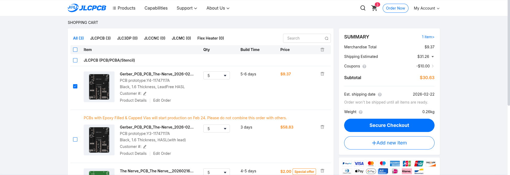

# 🧠 The Nerve – Modular Input Panel

> [!NOTE]
> **Reviewer's Note:** Major interfaces (Joystick, Encoders, Switches, OLED) are mounted in the enclosure and hand-wired to the PCB terminals. They are **not** surface-mounted to the board, which is why they are included in the cart but not fixed to the PCB render.

> 


> **Project Status:** Hardware Frozen / Firmware Development (ESP32-S3)

**The Nerve** is a tactile command center created to bring physical control back to digital workflows. Initially designed to automate video production pipelines (n8n + FFmpeg), its open hardware architecture makes it a powerful universal controller for developers, editors, and creators.

It bridges the gap between a macro pad and a fully programmable cyberdeck interface.

## 💰 Real Project Cost (Actual Checkout Totals)

The table below reflects the **actual amounts paid at checkout per vendor** — not just component unit prices. Each subtotal includes the vendor's shipping fee, any applicable taxes, and minimum order quantities (MOQ) where they apply.

| Vendor | Items Purchased | Checkout Total |
| :--- | :--- | ---: |
| **Adafruit** | ESP32-S3 ProS3 + Illuminated Toggle Switch | $30.45 |
| **Amazon** | Hall Joystick + Wire Kit + 2 Batteries | $38.94 |
| **Waveshare** | 1.5" RGB OLED Display | $16.99 |
| **Mouser** | Optical (Bourns) + Mechanical (Alps) Encoders | $47.10 |
| **MechanicalKeyboards** | Cherry MX2A Blue Switch | $0.50 |
| **JLCPCB** | PCB Fabrication + PCBA Assembly | $36.04 |
| **LCSC (Loose Parts)** | Screw & Expansion Connectors + Shipping/Fees | $17.45 |
| | **TOTAL** | **$187.47** |

### 🛠️ Minimum Cost to Replicate (Hardware Only)
If you want to build this project yourself, the pure cost of the hardware **without international shipping fees or MOQs** is roughly **~$142.60**. 
- Pure PCB/PCBA Cost: ~$36.04
- Pure Component Cost: ~$106.56

> **Why are these costs specific?**
> The values above reflect the exact amounts from the project's checkout screenshots, including the minimum quantities required by vendors (MOQs) and standard shipping for parts. 

> **Why is the JLCPCB line different?**
> The $36.04 JLCPCB cost covers:
> - **PCB fabrication** (5 copies, white solder mask, HASL finish)
> - **PCBA — automated SMD assembly** for all LCSC Basic Parts (passives, connectors, buzzer, RGB LED, capacitors, resistors)
> - **Pick & Place engineering fee** charged by the factory
>
> The LS7183N-S decoder IC was removed from the automated PCBA order due to stock and will be hand-soldered separately.

> **Why do some unit prices differ from hardware/fabrication/the_nerve_bom.csv?**
> `hardware/fabrication/the_nerve_bom.csv` lists LCSC **reference unit prices**. Actual storefront checkouts (like Adafruit or Waveshare) always win over catalog estimates.

## 🧱 Hardware Stack
Built around the **ESP32-S3 ProS3** for native USB, Wi-Fi, and Bluetooth capabilities.

- **Core:** Unexpected Maker ESP32-S3 ProS3 (Dual-core 240MHz, 16MB Flash).
- **Visual Feedback:**
  - **OLED:** Waveshare 1.5" RGB SPI (128x128) for real-time status, menus, and API data.
  - **RGB LED:** Immediate visual indications (e.g., server status, active recording).
- **Encoder:** High-precision Optical (Bourns 64PPR) and Mechanical (Alps 15PPR) for diverse tactile feedback prototyping.
- **Hall Effect Joystick:** Analog control without drift (Mouse/XY parameters).
- **Mechanical Switches:** Cherry MX Blue (Clicky) for satisfying execution.
- **Missile Switch:** Safety-covered toggle for critical actions (Deploy/Render).
- **Audio Feedback:** Passive buzzer for audible alerts.

## 🔌 Modular Architecture
**Important Note:** The PCB shown in the renders acts as a "Motherboard". To prevent mechanical stress on the PCB and allow for enclosure flexibility, all major interfaces (Joystick, Encoders, Switches, OLED) are NOT surface-mounted. They are **hand-wired** to the PCB using a flexible silicone wire kit via the onboard screw terminals and JST connectors.

The PCB features **screw terminals and JST connectors**, allowing sensors and inputs to be swapped without desoldering.

- **Universal 6-pin Interfaces (U1–U4):** Supports 3.3V and 5V peripherals.
- **8-pin Expansion Header (U5):** ZX-HY2.0 connector for additional modules.
- **Battery Ready:** Integrated LiPo management for wireless operation (JST 2-Pin).

See [`hardware/schematics/WIRING_DIAGRAM.md`](hardware/schematics/WIRING_DIAGRAM.md) for a complete wiring reference.

## 📂 Firmware, CAD, and Project Structure

### ⚡ Firmware Installation & Setup
The Nerve runs on **MicroPython**. Follow these steps to get it running:

1.  **Flash MicroPython:** Download the latest [MicroPython firmware for ESP32-S3](https://micropython.org/download/ESP32_GENERIC_S3/) and flash it using `esptool.py` or a tool like [Thonny IDE](https://thonny.org/).
2.  **Upload Code:** Use Thonny or `ampy` to upload the `firmware/main.py` file to the root of your ESP32-S3.
3.  **Run:** Reset the board. You should hear a startup beep and see the RGB LED glow cyan.
4.  **Dependencies:** None! The firmware uses only standard MicroPython libraries (`machine`, `time`, `json`).

> **Serial Communication:** The device sends JSON events over the Serial/USB port at **115200 baud**. You can use a host script or an automation tool like **n8n** (via Serial Trigger) to capture these events and execute your workflows.

### 📐 3D CAD & Enclosure
The enclosure was designed in **OnShape** with strict tolerances for mechanical parts.

- **Source File:** The primary source is the [**`the_nerve.step`**](hardware/3d_models/the_nerve.step) file. It contains the full assembly, including internal standoffs and ventilation slots.
- **3D Printing:** Use the `.stl` files in `hardware/3d_models/` for printing.
  - `the_nerve_case_main.stl`: Main body (printed face down).
  - `the_nerve_case_bottom.stl`: Flush-inside bottom cover.
- **Settings:** 0.2mm layer height, 15-20% infill, no supports needed for the main body if oriented correctly.

### 📁 Project Structure
The project is organized as follows:
```text
.
├── hardware/fabrication/the_nerve_bom.csv                  <-- Main Bill of Materials
├── README.md                <-- This file
├── hardware/
│   ├── 3d_models/           # Enclosure .step and .stl files
│   ├── fabrication/         # Gerber, BOM, and Pick & Place files for manufacturing
│   ├── pcb/                 # EasyEDA project source (.json)
│   └── schematics/          # PDF schematic and wiring diagram
├── firmware/
│   └── main.py              # Official MicroPython firmware
└── automation/              # Host integration (e.g., n8n flows)
```

## Manufacturing Preview


_Designed for those who need more than just a keyboard shortcut_
