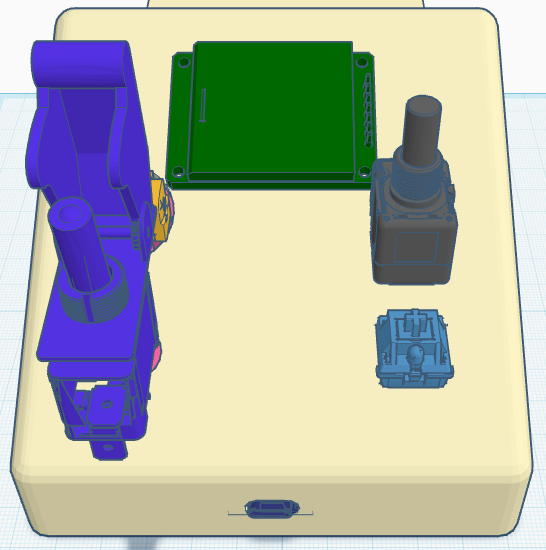
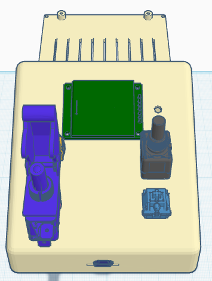
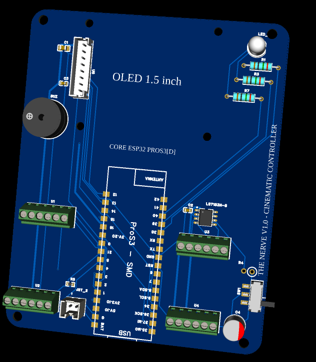
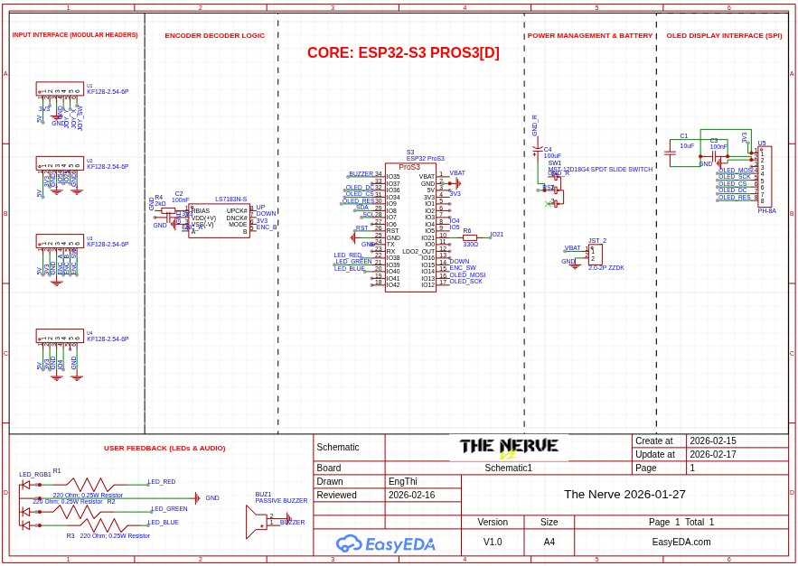

# 🧠 The Nerve – Custom Wireless Automation Controller

**The Nerve** is a **custom hardware** input device (Tier 3) designed for standalone workflow automation. Unlike standard macropads, it features an **integrated LiPo battery and Wi-Fi connectivity**, allowing it to trigger webhooks (n8n/API) and execute scripts without being tethered to a computer.

### 🎨 Design & Ergonomics



### 🧩 Custom PCB Layout


> **Project Status:** Hardware Design Complete (Custom PCB) / Firmware in MicroPython.

---

## 💰 Budget & Components (Tier 3 Optimized)

The total requested budget is **$115.12** (Base Component Cost). 
*Note: Builders in Brazil should expect an additional ~$38 in regional taxes/freight, as shown in the [AliExpress Cart](assets/journal/AliExpress_Cart_New.png).*

| Component | Source | Price | Purpose |
| :--- | :--- | :--- | :--- |
| **LiPo Battery** | Amazon | $9.99 | **Mandatory:** Enables standalone Wi-Fi operation. |
| **ESP32-S3 ProS3** | Adafruit | $26.50 | **MCU:** Native Wi-Fi for webhooks + USB HID. |
| **EC11 Encoder** | AliExpress | $1.50 | **Input:** Quadrature encoder for timeline scrolling. |
| **1.5" RGB OLED** | AliExpress | $11.93 | **Feedback:** UI for menus and API status. |
| **Hall Joysticks** | AliExpress | $7.39 | **Input:** Electromagnetic XY control (No Drift). |
| **Cherry MX Switches**| AliExpress | $5.74 | **Input:** Mechanical execution buttons. |
| **JLCPCB PCBA** | JLCPCB | $36.04 | **PCBA:** Custom board fabrication + SMT assembly. |
| **Screw Terminals** | LCSC | $12.00 | **Hardware:** Wire-to-board connectors. |
| **Switch & Parts** | Adafruit/LCSC| $3.95 | **Misc:** Safety missile switch + buzzer. |

---

## 🔌 Wiring & Assembly

### 🛠️ Assembly Strategy
This is a **Custom Hardware** project. I designed the PCB and the 3D enclosure from scratch.
*   **Factory PCBA:** JLCPCB handles the SMT soldering of small 0603 passives and the status LED.
*   **Hand-Wiring:** All major inputs (Joystick, Encoder, OLED) are **panel-mounted** to the 3D case and **hand-wired** to the PCB terminals to ensure mechanical durability.
*   **Manual Soldering:** I am hand-soldering the ESP32-S3, all JST connectors, and screw terminals.

### 📜 Wiring Diagram

*Detailed wiring reference for hand-connecting external sensors to the motherboard.*

---

## 📂 Project Structure
```text
.
├── the_nerve_bom.csv        # Final Component List
├── hardware/
│   ├── 3d_models/           # Case STL and STEP files
│   ├── fabrication/         # Gerber and Pick&Place files
│   └── schematics/          # Detailed Wiring & PDF Schematic
└── firmware/
    └── main.py              # MicroPython core logic
```

_Designed for standalone automation and tactile control._
