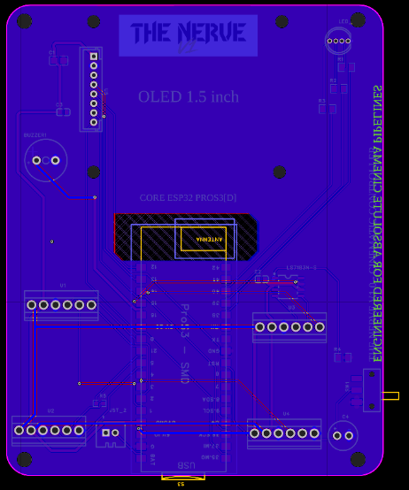
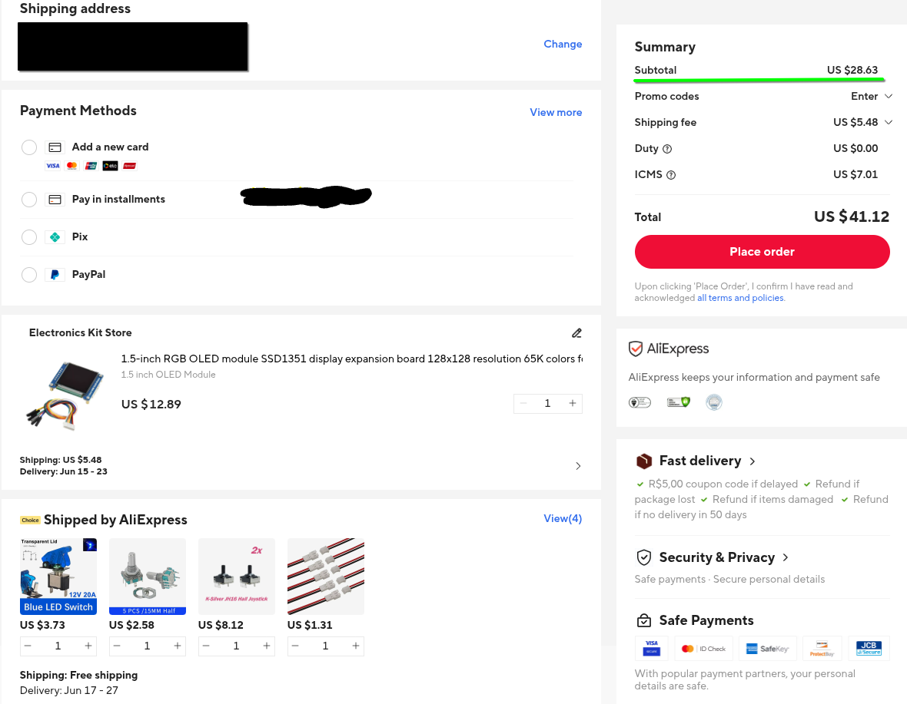
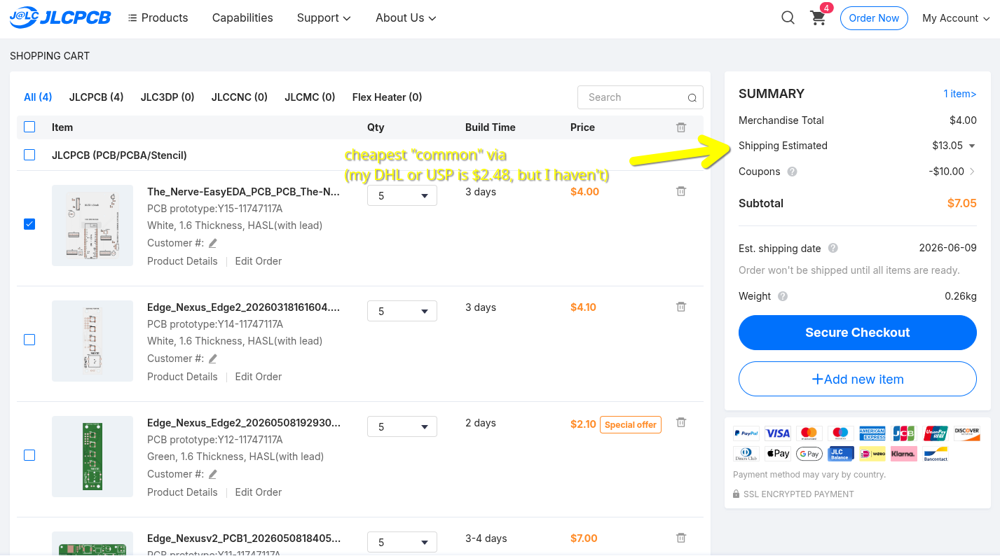
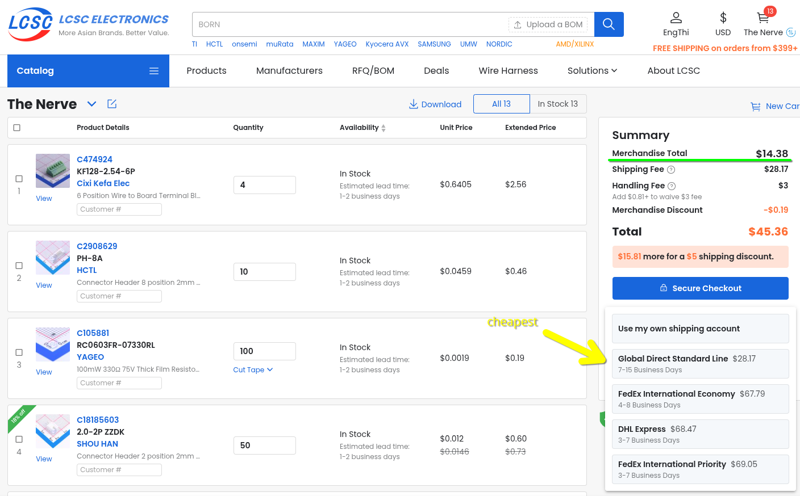
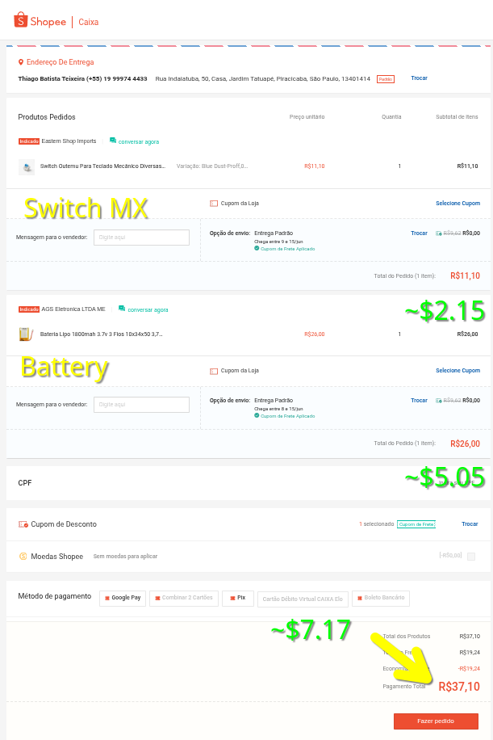

# The Nerve Automation Motherboard

> [!IMPORTANT]
> Reviewer, this project is a custom board placed in Tier 3. To stay within the $100 budget including international shipping fees and taxes, Version A (Round TFT) is the primary build configuration. All components are hand-soldered.

The Nerve is a modular controller for automation workflows and video pipelines. It uses an ESP32-S3 for native Wi-Fi, Bluetooth, and USB HID support.

[Specs](#hardware) | [Logs](JOURNAL.md) | [Budget](BLUEPRINT_BUDGET.md) | [Production](hardware/production/)

---

## Hardware Design

The PCB was designed in EasyEDA and the enclosure in OnShape.

### Enclosure Design

- [OnShape Public Link](https://cad.onshape.com/documents/f5fe8f1a3f0d54ab7cd3f1d7/w/a16133ebbda184e0e50a9073/e/bf72140826f3054b8f947155?renderMode=0&uiState=6a2071693fc56d9f8f5e1dc7)
- [Tinkercad 3D Model](https://www.tinkercad.com/things/edG28wTrG8o-enclousure-the-nerve?sharecode=HdeJpYusIbuaaVPp3prye_n_lixCraDDIvdvkDYTo2M)

### PCB Layout

- [Project Link in the Editor](https://pro.easyeda.com/editor#id=794fe6f5b1b64e09b8597b022e057335)

### BOM (Version A - Round TFT)
| Part | Description | Price | Link |
| :--- | :--- | :--- | :--- |
| **ESP32-S3-DevKit-LiPo** | Native USB HID and built-in LiPo charging. | $8.70 | [Olimex](https://www.olimex.com/Products/IoT/ESP32-S3/ESP32-S3-DevKit-Lipo.html) |
| **Custom PCB (5pcs)** | 2-layer PCB fabrication. | $4.00 | JLCPCB |
| **Toggle Switch Missile Cover** | Safety arming switch | $3.73 | [AliExpress](https://aliexpress.com/item/1005006733525021.html) |
| **Outemu MX Switches (10pcs)** | Mechanical switches | $2.12 | [Shopee](https://shopee.com.br/product/23418702594.html) |
| **K-Silver JH16 Hall Joystick (2x)**| Hall Effect analog stick | $8.12 | [AliExpress](https://aliexpress.com/item/1005008728261473.html) |
| **EC11 Rotary Encoder (10pcs)** | Rotary input | $2.58 | [AliExpress](https://aliexpress.com/item/2001241262.html) |
| **JST-PH 2.0mm 2P Connector** | Required for battery connection | $1.31 | [AliExpress](https://aliexpress.com/item/33024777806.html) |
| **Round TFT GC9A01 Display** | 1.28 inch SPI display. | $1.38 | [AliExpress](https://aliexpress.com/item/1005008284550510.html) |
| **LiPo 1800mAh 3.7V Battery** | Standalone power source. | $5.05 | [Shopee](https://shopee.com.br/product/55550251664.html) |
| **SMD Components Batch** | LCSC Caps, Resistors, ICs (LS7183N-S) | $14.38 | LCSC |

*(Full details and shipping/taxes breakdown in the [Hardware Budget](BLUEPRINT_BUDGET.md) and [BOM CSV](the_nerve_bom.csv))*

---

## How to Use

So, The Nerve works like a node or a kind of independent trigger that communicates with your computer (or server, those types of HID interfaces, etc) to run automated tasks. I like the part of triggering n8n/general webhooks or running FFmpeg video processing scripts, controlling something on your PC

### 1. Hardware Setup and Firmware Flashing
1. **Wire the Panel:** Connect the Joystick to the `ADC1` pins (Pins 1 and 2), the Rotary Encoder to the Quadrature Decoder pins (Pins 15 and 16) and the Cherry MX Switch and the Missile Toggle to their respective JST ports, according to the [Wiring Diagram](assets/diagrams/EXTERNAL_WIRING_GUIDE.png) that is right below. This way you can swap ports but they have to be compatible with the type of signal and mechanics of that device you are going to use.

2. **Flash the Firmware:** Connect the ESP32 via USB-C. Install MicroPython on the board and upload the `firmware/main.py` file (or whatever you develop for your own type of use). You can improve or change this entirely, since I developed it to be multi-use and very customizable. Use different types of components, parts, etc

3. **Turn on:** You can turn it on through the USB-C cable or totally independently using the 1800mAh LiPo battery (the ProS3 and even the new one from Olimex has built-in charging) . Upon turning on, it plays a startup tone and the RGB LED turns blue.

### 2. Operation
- **Safety Switch (Safety Lock):** Before running any command, you must lift the switch cover and turn it on. The system will be armed and an LED indicator will light up.
- **Intensity Selector (Rotary Encoder):** Turn the encoder to adjust the "Intensity Level" (0 to 100). The RGB LED changes from blue to red to visually represent the intensity level you are setting for your automation task.

- **Timeline Navigation (Joystick):** Move the joystick to adjust the X/Y parameters (useful for navigating the timeline or adjusting the visual positioning in your scripts).
- **Execute (Cherry MX Switch):** Press the mechanical switch to fire the command. If the missile switch is *armed*, it will flash white, play an execution tone and send a JSON payload via serial (or via Wi-Fi through webhooks) containing all the dial and joystick parameters. If it's *disarmed*, it will flash red and play an error warning tone.

 Open n8n and import the workflows found in the `automation/n8n/flows/` directory.

The `trigger_executor.json` file brings a script that waits for a webhook.

A local Python script on your PC (or directly on the ESP32 via Wi-Fi) listens to the JSON serial output from The Nerve and forwards it to your n8n webhook (or wherever it is, kinda), which then parses the "Hype Level" and Joystick parameters to run the logic of the `video_pipeline.json` file.

I think that's pretty much it :P

---

---

## Build and Budget

The total delivered cost for Version A is **$99.77**.

Detailed evidence can be found in the [Hardware Budget](BLUEPRINT_BUDGET.md).

### Evidence Gallery

---

_Designed by ChefThi for Hack Club Blueprint._
