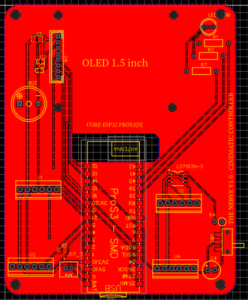
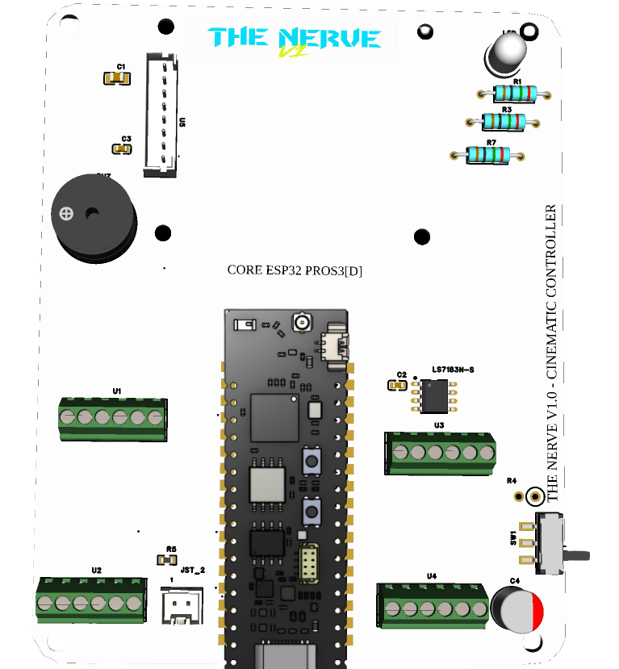
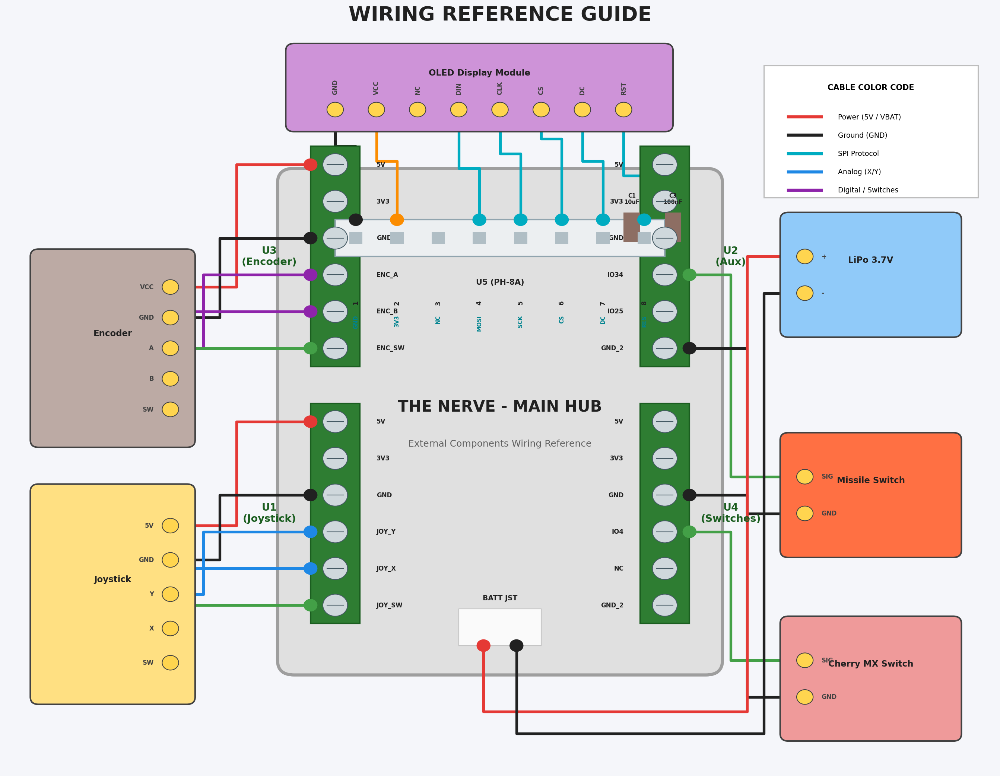

# The Nerve — Standalone Automation Node

> [!IMPORTANT]
> **Note to Reviewers:** This is a **custom hardware** project (Tier 3). I designed the PCB and the 3D enclosure from scratch. To keep the budget under $100, I removed the factory PCBA service—I will hand-solder everything myself, including the SMT passives. All sensors are panel-mounted and hand-wired to the motherboard to protect the PCB from mechanical stress. The 3000mAh battery is mandatory for standalone Wi-Fi operation.

The Nerve is a custom hardware controller I built to trigger webhooks and macros over Wi-Fi. It uses an ESP32-S3 to talk directly to n8n or local APIs without needing a host PC.

[Specs](#hardware) | [Logs](JOURNAL.md) | [Budget](BLUEPRINT_BUDGET.md) | [Production](hardware/production/)

---

---

## What it is

Most macro pads are just USB keyboards. I designed The Nerve to be a standalone Wi-Fi device. It runs on a 3000mAh battery so I can use it as a remote for my server-side video pipelines.

- **Direct Triggers:** Hits n8n webhooks directly via Wi-Fi.
- **Precision Control:** Hall Effect joystick (no drift) and an EC11 encoder.
- **Visuals:** SSD1351 RGB OLED for real-time API feedback.

---

## Hardware Design 

I designed the PCB in EasyEDA and the enclosure in OnShape. The board acts as a central hub for panel-mounted sensors.

### PCB Layout

### Parts
| Part | Why |
| :--- | :--- |
| **ESP32-S3 ProS3** | Native USB HID + built-in LiPo charging. |
| **K-Silver JH16** | Hall Effect sensor (no drift). |
| **LS7183N-S IC** | Hardware quadrature decoder to offload the MCU. |
| **3000mAh Battery** | Required for standalone wireless operation. |

---

## Build & Budget

The hardware cost is **$78.27**. 

I optimized the budget by removing the factory assembly service (PCBA). I will be hand-soldering every component myself—including the 0603 SMT resistors and capacitors—to demonstrate technical proficiency and keep the project within the $100 limit.

### External Wiring Guide

*Detailed map for hand-connecting external sensors to the motherboard.*

---

_Designed by @EngThi for Hack Club Blueprint._
